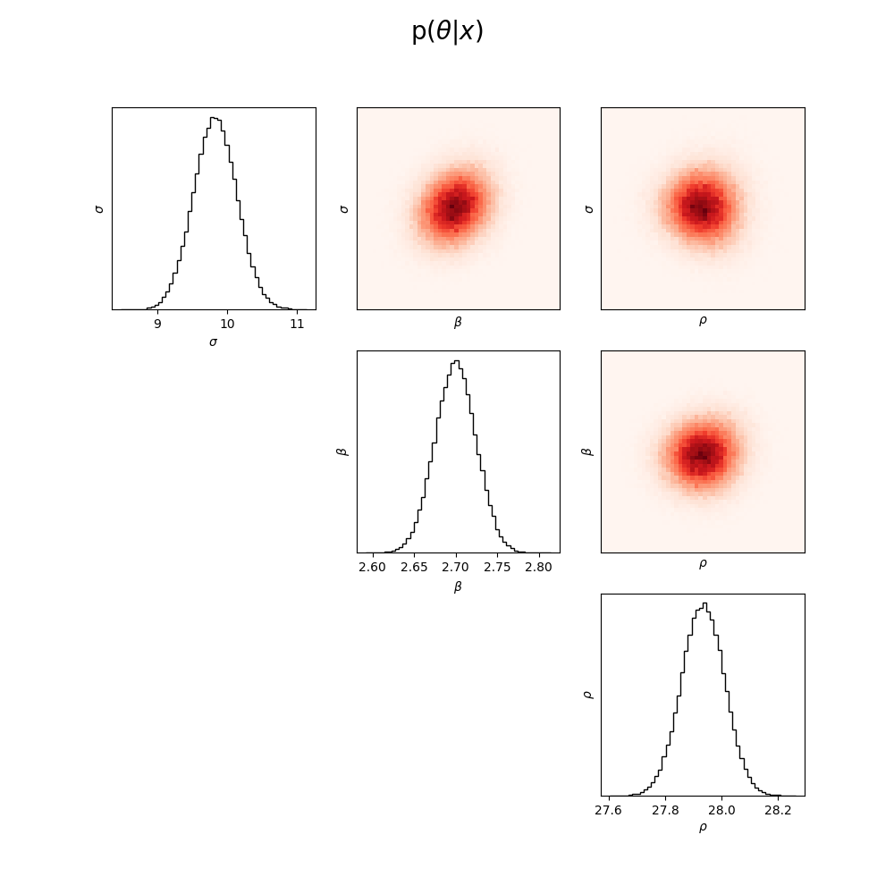

# Lorenz SBI
Repository for running simulation based inference (SBI) pipeline on the simple Lorenz system. The Lorenz system has 3 parameters ($\sigma$, $\beta$, and $\rho$) and a set of summary statistics (*mean*, *covariance*, *correlation*, *eigvalues*, *lyapunov exponents*) based on which the neural network will train.
This repository is made for educational purposes and serves as a starting point to implement your own models!

The figure shows an example inferred posterior. The real parameters are: $\sigma = 10$, $\beta = \frac{8}{3}$, and $\rho = 28$. The trained network was able to recover these parameters using only the observation statistics.




## Installation on Linux
Create virtual environment
```
python venv -m env_name
```

Activate environment
```
source env_name/bin/activate
```

Install requirements
```
pip install -r requirements.txt
```

## Usage
The full pipeline for inference is given here:

#### 1. Run simulations
To run simulations in parallel on multiple CPU cores run the following code:
```
mpirun -n num_cores python cpu_sims.py
```

#### 2. Train density estimator
To train a neural density estimator on the CPU run the following lineL
```
python3 train.py --device cpu
```
To train on GPU run:
```
python3 train.py --device cuda
```

#### 3. Get posterior
The following line will generate a pairplot figure of the full posterior given the observation statistics of the Lorenz system with parameters: $\sigma = 10$, $\beta = \frac{8}{3}$, and $\rho = 28$.
```
python3 posterior.py
```

Many settings can be altered. This repository is made for educational purposes and serves as a starting point to implement your own models.